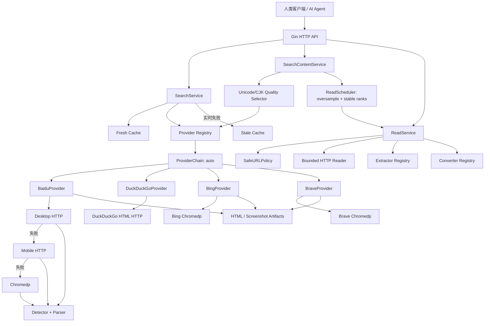

# Web Search Backend Demo

一个面向人类客户端和 AI Agent 的 Go + Gin 网页搜索 API。项目通过通用 `Provider` 接口注册 Baidu、DuckDuckGo、Bing、Brave 和自动 fallback Chain。

当前实现不使用付费 SERP API。搜索链路读取公开搜索结果页，并通过跨 Provider fallback、Provider 质量选择、超额候选、Provider 内部 transport fallback、缓存、限流、抖动和熔断提供 best-effort 可用性；独立的 Read API 可按需读取某条结果的 HTML/纯文本正文并转换为 Markdown 或 text。

## 架构



职责边界：

- Gin：路由、query binding、request ID、客户端限流和 JSON 编码。
- SearchService：参数归一化、fresh/stale cache 和 `singleflight`。
- Provider Registry：按名称查找 `auto`、`baidu`、`duckduckgo`、`bing` 和 `brave`。
- ProviderChain：兼容 `GET /v1/search`，默认按 `baidu → duckduckgo → bing → brave` 执行跨搜索源 fallback。
- BaiduProvider：编排 `desktop_http → mobile_http → chromedp`。
- DuckDuckGoProvider：读取轻量 HTML 搜索页，不启动浏览器。
- BingProvider：使用独立 Chromedp Profile 读取 Bing 结果页。
- BraveProvider：使用独立 Chromedp Profile 读取 Brave 公开结果页。
- QualityProviderSelector：组合模式下并发观察 `baidu → bing → brave → duckduckgo`，使用 Unicode/CJK 相关性、字段完整率和域名多样性选择整组结果。
- SearchContentService：按 \(C=\min(2N+2,20)\) 超额搜索候选，并发读取后按原始排名保留前 \(N\) 条成功正文。
- Detector：区分正常页、空结果、验证码、429、封禁和 DOM 变化。
- Parser：分别解析桌面页、移动页和浏览器 DOM。
- DebugArtifactStore：保存完整 HTML、截图以及 SHA-256。
- ReadService：执行 URL 安全策略、正文缓存、HTTP 优先读取、Chromedp 按需渲染、提取、质量判断和格式转换；HTTPReader 与 BrowserReader 通过统一接口解耦。
- Read Pipeline：`URLPolicy`、`ResourceReader`、`SourceTypeDetector`、`ContentExtractor`、`QualityEvaluator`、`ContentConverter`、`ReadCache` 均通过窄接口解耦。

## 本机运行

环境要求：

- Go 1.26 或更新版本。
- Google Chrome。当前机器可直接使用 `/Applications/Google Chrome.app`。

```bash
cd /Users/zoe/Documents/daily/web-search-backend
make
# 等价于 make run
```

`make run` 最终执行 `go run ./cmd/server`。如需直接使用底层命令：

运行日志会同时显示在终端并追加写入 `log/server.log`。可通过 `LOG_FILE` 覆盖路径，例如 `make run LOG_FILE=log/debug.log`。

```bash
go mod download
go run ./cmd/server
```

服务默认监听 `:8080`。测试：

```bash
curl --get 'http://127.0.0.1:8080/v1/search' \
  --data-urlencode 'q=golang' \
  --data 'provider=auto' \
  --data 'limit=10' \
  --data 'page=1'
```

或运行：

```bash
make smoke Q='golang'
```

浏览器访问 [http://127.0.0.1:8080/ui/](http://127.0.0.1:8080/ui/) 可使用内嵌的 Searchroom：

- 设置 query、Provider、limit、page、refresh、debug 和 Debug Token。
- 可开启“返回可读正文”，设置候选上限、format 和 max chars，直接调用统一 `POST /v1/search`。
- 查看每条结果的实际 Provider、fallback、缓存、warnings 和 attempts。
- 点击结果调用 `/v1/read`，查看渲染后的 Markdown、原始 Markdown/text、可折叠 JSON Tree 和 Debug。
- Debug Token 只保存在浏览器 `sessionStorage`，不会进入 URL。

## Docker 运行

Docker Desktop 新版本通常使用 `docker compose`。当前这台 Mac 的 Colima 环境安装的是独立命令 `docker-compose`，两者使用同一个 `compose.yaml`；以下命令已在本机实测通过：

```bash
make docker-up
make docker-ps
make smoke Q='golang'
```

Makefile 会自动选择 `docker compose` plugin 或独立的 `docker-compose`。需要直接排查 Compose 时，当前 Mac 可使用：

```bash
docker-compose build
docker-compose up -d
docker-compose ps
```

容器使用非 root 用户运行。Baidu、Bing、Brave 与正文读取使用独立 Chromium Profile；Profile 和调试文件分别持久化到独立 volume。

停止服务：

```bash
make docker-down
```

如需同时清理 Demo 创建的所有 volume：

```bash
docker-compose down --volumes
```

## API

### `GET /v1/search`

| 参数 | 必填 | 默认值 | 范围 |
|---|---:|---:|---|
| `q` | 是 | - | 1–256 个字符 |
| `provider` | 否 | `auto` | 支持 `auto`、`baidu`、`duckduckgo`、`bing`、`brave`；显式 Provider 不跨源 fallback |
| `limit` | 否 | `10` | 1–20 |
| `page` | 否 | `1` | 1–10 |
| `refresh` | 否 | `false` | `true` 跳过 fresh cache，强制实时查询 |
| `debug` | 否 | `false` | `false` 或省略时返回干净响应；`true` 必须通过 Debug Token 鉴权 |

成功响应：

```json
{
  "query": "golang",
  "provider": "baidu",
  "results": [
    {
      "title": "The Go Programming Language",
      "url": "https://go.dev/",
      "snippet": "Go is an open source programming language...",
      "rank": 1,
      "provider": "baidu"
    }
  ],
  "meta": {
    "requested_provider": "auto",
    "transport": "desktop_http",
    "cached": false,
    "degraded": false,
    "fallback_count": 0,
    "provider_fallback_count": 0,
    "took_ms": 382,
    "request_id": "req_01J..."
  },
  "warnings": [],
  "debug": {
    "attempts": [],
    "raw_artifacts": []
  }
}
```

顶层 `provider` 是本次结果集的实际搜索源；每条 `results[].provider` 是该条内容的来源；`requested_provider` 是调用方选择的值。`fallback_count` 表示单个 Provider 内部 transport fallback 次数，`provider_fallback_count` 表示跨 Provider fallback 次数。

`transport` 可能是 `desktop_http`、`mobile_http`、`chromedp`、`duckduckgo_http`、`bing_chromedp`、`brave_chromedp`、`fresh_cache` 或 `stale_cache`。

### `POST /v1/search`

同一路径的高级 JSON 调用。`content` 缺省或 `enabled=false` 时只执行轻量搜索；`content.enabled=true` 时执行质量选源、超额候选和正文读取。正文模式的 `limit` 范围为 1–10，默认 5。

```bash
curl 'http://127.0.0.1:8080/v1/search' \
  --header 'Content-Type: application/json' \
  --data '{
    "query": "Go 语言并发模型",
    "provider": "auto",
    "limit": 5,
    "content": {
      "enabled": true,
      "candidate_limit": 0,
      "format": "markdown",
      "max_chars": 30000
    },
    "refresh": false,
    "debug": false
  }'
```

`candidate_limit=0` 自动使用：

\[
C=\min(2N+2,20)
\]

其中 \(N\) 是请求的可读正文数，\(C\) 是搜索候选数。例如请求 5 篇正文时搜索 12 条候选。读取完成顺序不会改变排名：`original_rank` 保留 Provider 原始名次，`selected_rank` 是本次成功正文的连续序号。

成功数不足 `limit` 但至少有一篇时仍返回 HTTP 200，并设置 `meta.partial=true` 和 `partial_readable_results` warning；全部候选读取失败时返回 HTTP 422 `insufficient_readable_results`。`debug=true` 需要同一 `X-Debug-Token`，失败响应会额外包含 `search_attempts` 与 `read_attempts` 的原始信息。

### 强制刷新

`refresh=true` 跳过 fresh cache，直接查询 Provider；实时查询失败时仍允许返回 stale cache：

```bash
curl --get 'http://127.0.0.1:8080/v1/search' \
  --data-urlencode 'q=golang' \
  --data 'refresh=true'
```

### 请求级 Debug

通过授权 token 临时采集当前请求的诊断信息：

```bash
export SEARCH_DEBUG_TOKEN='replace-with-a-random-secret'

curl --get 'http://127.0.0.1:8080/v1/search' \
  --data-urlencode 'q=golang' \
  --data 'debug=true' \
  --header "X-Debug-Token: ${SEARCH_DEBUG_TOKEN}"
```

`debug=true` 自动隐含 `refresh=true`，确保 attempts、headers、HTML preview 和 artifacts 来自本次实时请求。Token 只能放在 `X-Debug-Token` Header，不要放入 URL。Token 缺失、错误或服务端未配置时返回 HTTP 403 `debug_unauthorized`。

`debug=false` 或省略 `debug` 始终只返回标准字段，即使服务运行在 Gin Debug 模式也不会绕过 Token。授权 Debug 数据不会写入共享搜索缓存，后续普通请求不会读到上一次的诊断信息。

### `POST /v1/read`

请求一个搜索结果 URL，返回经过清洗和长度限制的正文。第一阶段支持 `text/html`、`application/xhtml+xml` 和 `text/plain`；PDF 明确返回 `unsupported_content_type`，留到第二阶段。

```bash
curl 'http://127.0.0.1:8080/v1/read' \
  --header 'Content-Type: application/json' \
  --data '{
    "url": "https://go.dev/doc/",
    "format": "markdown",
    "max_chars": 30000,
    "refresh": false,
    "debug": false
  }'
```

`format` 支持 `markdown`、`text`；`max_chars` 范围为 1000–100000，按 Unicode 字符计数并优先在段落边界截断。`debug=true` 与搜索接口相同，需要 `X-Debug-Token` 并自动强制 refresh。

```json
{
  "url": "https://go.dev/doc/",
  "final_url": "https://go.dev/doc/",
  "title": "Documentation",
  "source_type": "html",
  "content": "# Documentation\n\n...",
  "content_format": "markdown",
  "content_length": 12580,
  "truncated": false,
  "meta": {
    "transport": "http",
    "extractor": "readability",
    "cached": false,
    "degraded": false,
    "fallback_count": 0,
    "took_ms": 312,
    "request_id": "req_01J..."
  },
  "warnings": []
}
```

读取链路为 `SafeURLPolicy → HTTPReader → MIME Detector → Extractor → Quality → Converter`。当 HTTP 返回 JS challenge、无法提取正文或质量判断为 JS shell 时，服务会按需执行一次 `BrowserReader → Detector → Extractor → Quality → Converter`。浏览器执行页面脚本并读取最终 DOM，不会自动填写验证码、登录账号或绕过付费墙；浏览器渲染仍没有正文时会返回明确错误。

BrowserReader 使用独立 Profile、单请求 deadline、默认 3 个并发 tab slot 和 DOM 大小上限。当前实现面向本机 Demo：主 URL 和最终 URL 都经过 SafeURLPolicy，但浏览器加载的页面子资源尚未通过 HTTPReader 的 DNS pinning transport。部署到不可信公网前，应将浏览器 reader 放入无内网路由的隔离 worker/容器并配置 egress policy；也可以设置 `SEARCH_READ_BROWSER_ENABLED=false` 完全关闭它。

SSRF 防护会拒绝私网、回环、link-local、CGNAT、Metadata、组播、非法协议和危险重定向。Demo 如需读取本机 fixture，只能通过 `SEARCH_READ_HOST_ALLOWLIST` 精确允许 Host；allowlist 仍不能开放 Metadata 或 link-local 地址。

如果本机 Clash/Mihomo 使用 fake-IP，DNS 可能返回 `198.18.x.x`；该保留网段会被 Read API 拒绝。开发时应在当前实际生效的 Clash 配置中，将测试域名加入 `dns.fake-ip-filter` 并重载内核，使应用拿到真实 IP；不要在后端放行整个 `198.18.0.0/15`。搜索结果域名是动态的，若要测试任意站点，应使用独立的 real-IP DNS 开发配置，而不是逐条维护业务代码白名单。

### 授权原始错误

只有显式 `debug=true` 且 `X-Debug-Token` 正确时，失败响应才同时提供稳定错误码和原始上游信息：

```json
{
  "error": {
    "code": "captcha_required",
    "message": "百度返回安全验证页面",
    "retryable": true,
    "original_error": "baidu response classified as captcha: status=200 final_url=https://wappass.baidu.com/..."
  },
  "meta": {
    "provider": "baidu",
    "request_id": "req_01J..."
  },
  "debug": {
    "attempts": [
      {
        "transport": "desktop_http",
        "http_status": 200,
        "classification": "captcha",
        "original_error": "baidu response classified as captcha: status=200 final_url=...",
        "body_preview": "<!doctype html>...",
        "body_sha256": "..."
      }
    ],
    "raw_artifacts": [
      "var/debug/req_01J/desktop_http.html",
      "var/debug/req_01J/chromedp.png"
    ]
  }
}
```

每个 fallback attempt 都保留：

- Transport 名称、请求 URL、最终 URL和耗时。
- HTTP status、分类结果和 Parser error。
- 原始 Go error。
- 已脱敏的响应头。
- 最多 32 KiB 正文 preview 和完整正文 SHA-256。
- 完整 HTML；chromedp 还会保存截图。

以下信息不会进入 API 响应：`Cookie`、`Set-Cookie`、`Authorization`、`Proxy-Authorization` 和 Chrome Profile 身份数据。

普通请求永远不会返回 `original_error`、attempt 正文和本地 artifact 路径；`SEARCH_DEBUG` 只控制 Gin 运行模式，不构成 API Debug 授权。

## 错误码

| HTTP | code | 含义 |
|---:|---|---|
| 400 | `invalid_request` | 参数错误 |
| 403 | `debug_unauthorized` | 请求级 Debug token 缺失、错误或服务端未配置 |
| 404 | `provider_not_found` | Provider 未注册 |
| 429 | `rate_limited` | 本服务或百度限流 |
| 502 | `upstream_changed` | 百度 DOM 变化导致解析失效 |
| 503 | `captcha_required` | 百度要求安全验证且没有 stale cache |
| 503 | `provider_unavailable` | 所有 Transport 不可用或处于熔断状态 |
| 504 | `upstream_timeout` | 整体搜索链路超时 |
| 403 | `unsafe_url` | Read URL、DNS 结果或重定向目标不安全 |
| 415 | `unsupported_content_type` | Read 第一阶段不支持 PDF、图片或 Office 文件 |
| 413 | `content_too_large` | 解压后的资源超过读取硬上限 |
| 422 | `extraction_failed` | HTTP 与浏览器路径都未提取到有效正文，或浏览器 fallback 被关闭 |
| 422 | `insufficient_readable_results` | 组合搜索的全部候选都未产生有效正文 |
| 502 | `fetch_failed` | Read DNS、TLS、连接或上游响应失败 |
| 504 | `fetch_timeout` | Read 获取或渲染超时 |

正常零结果返回 HTTP 200 和 `results: []`。只有检测到正常搜索页根节点后，空数组才被视为真正的空结果。

## 稳定性策略

- Fresh cache：15 分钟。
- Stale cache：24 小时。
- 相同查询使用 `singleflight` 合并并发请求。
- BaiduProvider 默认每秒 1 次，burst 3。
- 每次上游访问增加 200–800 ms jitter。
- Desktop/Mobile HTTP 使用稳定 User-Agent、Cookie Jar 和连接池。
- CAPTCHA 对相应 Transport 熔断 30 分钟。
- HTTP 429 对相应 Transport 熔断 5 分钟。
- 搜索 Chromedp client 默认最多 2 个并发 tab，正文 Chromedp client 默认最多 3 个并发 tab。
- Baidu、Bing、Brave 和正文读取使用不同的 Chrome Profile，Cookie 与 Session 不共享。
- `auto` 只对验证码、限流、超时、上游结构变化和 Provider 不可用执行跨源 fallback。
- 实时失败且存在 stale cache 时返回 HTTP 200、`degraded=true`，并附带本次实时失败 attempts。

## 环境变量

| 变量 | 默认值 | 说明 |
|---|---|---|
| `SEARCH_ADDR` | `:8080` | 监听地址 |
| `SEARCH_DEBUG` | `true` | Gin 开发/发布运行模式；不绕过 Debug Token |
| `SEARCH_DEBUG_TOKEN` | 空 | 请求级 `debug=true` 使用的 `X-Debug-Token`；空值拒绝请求级 Debug |
| `SEARCH_DEBUG_DIR` | `./var/debug` | HTML/截图目录 |
| `SEARCH_DEBUG_PREVIEW_BYTES` | `32768` | API 正文 preview 上限 |
| `SEARCH_CHROME_PROFILE_DIR` | `./var/chrome-profile` | 持久化 Chrome Profile |
| `SEARCH_BING_PROFILE_DIR` | `./var/chrome-profile-bing` | Bing 独立 Chrome Profile |
| `SEARCH_BRAVE_PROFILE_DIR` | `./var/chrome-profile-brave` | Brave 独立 Chrome Profile |
| `SEARCH_CHROME_PATH` | 空 | Chrome/Chromium 可执行文件 |
| `SEARCH_CHROME_HEADLESS` | `true` | 是否无头运行 |
| `SEARCH_CHROME_NO_SANDBOX` | `false` | Docker 中可设为 `true` |
| `SEARCH_TOTAL_TIMEOUT` | `20s` | 整体请求超时 |
| `SEARCH_CONTENT_TIMEOUT` | `30s` | 组合搜索与正文读取的整体请求超时 |
| `SEARCH_DESKTOP_TIMEOUT` | `4s` | Desktop HTTP 超时 |
| `SEARCH_MOBILE_TIMEOUT` | `4s` | Mobile HTTP 超时 |
| `SEARCH_CHROME_TIMEOUT` | `10s` | Chromedp 超时 |
| `SEARCH_DUCKDUCKGO_URL` | `https://html.duckduckgo.com/html/` | DuckDuckGo HTML 搜索地址 |
| `SEARCH_DUCKDUCKGO_TIMEOUT` | `5s` | DuckDuckGo HTTP 超时 |
| `SEARCH_BING_URL` | `https://www.bing.com/search` | Bing 搜索地址 |
| `SEARCH_BING_TIMEOUT` | `10s` | Bing Chromedp 超时 |
| `SEARCH_BRAVE_URL` | `https://search.brave.com/search` | Brave 搜索地址 |
| `SEARCH_BRAVE_TIMEOUT` | `10s` | Brave Chromedp 超时 |
| `SEARCH_PROVIDER_BROWSER_SLOTS` | `2` | 每个搜索浏览器 client 的最大并发 tab 数 |
| `SEARCH_FRESH_TTL` | `15m` | fresh cache TTL |
| `SEARCH_STALE_TTL` | `24h` | stale 最大年龄 |
| `SEARCH_PROVIDER_RATE` | `1` | Provider token/s |
| `SEARCH_PROVIDER_BURST` | `3` | Provider burst |
| `SEARCH_JITTER_MIN` | `200ms` | 上游请求最小 jitter |
| `SEARCH_JITTER_MAX` | `800ms` | 上游请求最大 jitter |
| `SEARCH_CLIENT_RATE` | `5` | 每客户端 IP token/s |
| `SEARCH_CLIENT_BURST` | `10` | 每客户端 IP burst |
| `SEARCH_TRUSTED_PROXIES` | 空 | 逗号分隔的可信内网 CIDR |
| `SEARCH_READ_ENABLED` | `true` | 是否注册 `POST /v1/read` |
| `SEARCH_READ_HTTP_TIMEOUT` | `6s` | HTTP 正文读取超时 |
| `SEARCH_READ_BROWSER_ENABLED` | `true` | 是否在符合条件时启用 Chromedp 正文 fallback |
| `SEARCH_READ_BROWSER_TIMEOUT` | `12s` | 单次浏览器正文读取超时 |
| `SEARCH_READ_BROWSER_WAIT` | `2s` | DOM ready 后等待页面脚本渲染的时间 |
| `SEARCH_READ_BROWSER_SLOTS` | `3` | 正文浏览器最大并发 tab 数 |
| `SEARCH_READ_CHROME_PROFILE_DIR` | `./var/chrome-profile-read` | 正文浏览器独立 Profile 目录 |
| `SEARCH_READ_FRESH_TTL` | `30m` | 正文 fresh cache TTL |
| `SEARCH_READ_STALE_TTL` | `24h` | 正文 stale cache 最大年龄 |
| `SEARCH_READ_CACHE_MAX_ITEMS` | `500` | 正文内存缓存条目上限 |
| `SEARCH_READ_MAX_BODY_BYTES` | `5242880` | 解压后正文资源硬上限 |
| `SEARCH_READ_MAX_REDIRECTS` | `5` | 正文 HTTP 重定向上限 |
| `SEARCH_READ_HOST_ALLOWLIST` | 空 | 允许读取私网/回环的精确 Host；只用于受控本机 Demo |

所有非空配置都严格解析。值非法时服务拒绝启动，不会静默回退到默认值。

## 测试

默认测试完全离线：

```bash
make check
```

`make check` 顺序执行普通测试、Race Detector、`go vet` 和二进制构建。也可以单独执行 `make test`、`make test-race`、`make vet` 或 `make build`。

离线端到端测试会启动本地假百度、DuckDuckGo 和正文服务器，并通过静态 Bing/Brave fixture 完整验证 Gin、SearchService、质量选源、超额候选、ReadScheduler、Provider、Transport、Detector、Extractor 和 Converter 链路。

## 边界

- 本项目无法保证百度、DuckDuckGo、Bing 或 Brave 永不返回验证码或限流。
- 不自动解题、破解或绕过验证码。
- 持久化 Profile、缓存、低频率、jitter 和熔断用于减少触发概率及避免反复冲击上游。
- 搜索引擎调整 DOM 后需要更新对应 Parser fixture 和 selector。
- `auto` fallback 返回的是实际成功搜索源的排名；它不能冒充百度排名。
- 免费、固定搜索源精确排名、无人值守高可用无法同时得到保证；本 Demo 对不可用情况返回明确、可诊断的结构化结果。
- Read API 不破解验证码、登录、付费墙或访问控制，不携带调用方 Cookie/Authorization，不递归抓取链接。
- 第一阶段不解析 PDF、Office、图片或 OCR，也不保证 Readability 能从任意网页提取出有效正文。
