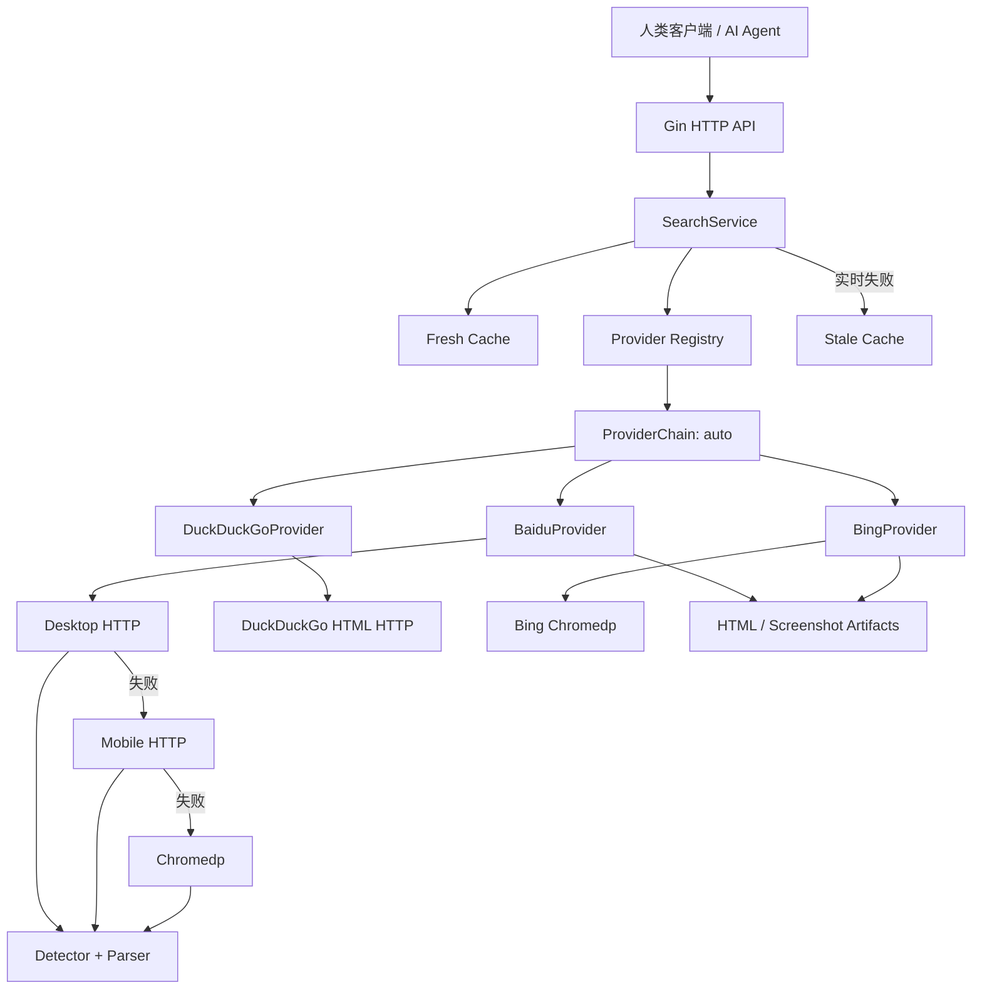

# Web Search Backend Demo

一个面向人类客户端和 AI Agent 的 Go + Gin 网页搜索 API。项目通过通用 `Provider` 接口注册 Baidu、DuckDuckGo、Bing 和自动 fallback Chain。

当前实现不使用付费 SERP API，也不抓取搜索结果目标网页的正文。它直接读取公开搜索结果页，并通过跨 Provider fallback、Provider 内部 transport fallback、缓存、限流、抖动和熔断提供 best-effort 可用性。

## 架构



职责边界：

- Gin：路由、query binding、request ID、客户端限流和 JSON 编码。
- SearchService：参数归一化、fresh/stale cache 和 `singleflight`。
- Provider Registry：按名称查找 `auto`、`baidu`、`duckduckgo` 和 `bing`。
- ProviderChain：默认按 `baidu → duckduckgo → bing` 执行跨搜索源 fallback。
- BaiduProvider：编排 `desktop_http → mobile_http → chromedp`。
- DuckDuckGoProvider：读取轻量 HTML 搜索页，不启动浏览器。
- BingProvider：使用独立 Chromedp Profile 读取 Bing 结果页。
- Detector：区分正常页、空结果、验证码、429、封禁和 DOM 变化。
- Parser：分别解析桌面页、移动页和浏览器 DOM。
- DebugArtifactStore：保存完整 HTML、截图以及 SHA-256。

## 本机运行

环境要求：

- Go 1.26 或更新版本。
- Google Chrome。当前机器可直接使用 `/Applications/Google Chrome.app`。

```bash
cd /Users/zoe/Documents/daily/web-search-backend
make
# 等价于 make run
```

`make run` 最终执行 `go run ./cmd/server`。如需直接使用底层命令：

```bash
go mod download
go run ./cmd/server
```

服务默认监听 `:8080`。测试：

```bash
curl --get 'http://127.0.0.1:8080/v1/search' \
  --data-urlencode 'q=golang' \
  --data 'provider=auto' \
  --data 'limit=10' \
  --data 'page=1'
```

或运行：

```bash
make smoke Q='golang'
```

## Docker 运行

Docker Desktop 新版本通常使用 `docker compose`。当前这台 Mac 的 Colima 环境安装的是独立命令 `docker-compose`，两者使用同一个 `compose.yaml`；以下命令已在本机实测通过：

```bash
make docker-up
make docker-ps
make smoke Q='golang'
```

Makefile 会自动选择 `docker compose` plugin 或独立的 `docker-compose`。需要直接排查 Compose 时，当前 Mac 可使用：

```bash
docker-compose build
docker-compose up -d
docker-compose ps
```

容器使用非 root 用户运行。Chromium Profile 和调试文件分别持久化到 `chrome-profile`、`debug-artifacts` volume。

停止服务：

```bash
make docker-down
```

如需同时删除 Demo 创建的两个 volume：

```bash
docker-compose down --volumes
```

## API

### `GET /v1/search`

| 参数 | 必填 | 默认值 | 范围 |
|---|---:|---:|---|
| `q` | 是 | - | 1–256 个字符 |
| `provider` | 否 | `auto` | 支持 `auto`、`baidu`、`duckduckgo`、`bing`；显式 Provider 不跨源 fallback |
| `limit` | 否 | `10` | 1–20 |
| `page` | 否 | `1` | 1–10 |
| `refresh` | 否 | `false` | `true` 跳过 fresh cache，强制实时查询 |
| `debug` | 否 | 服务配置 | `false` 返回干净响应；`true` 需要 Debug Token |

成功响应：

```json
{
  "query": "golang",
  "provider": "baidu",
  "results": [
    {
      "title": "The Go Programming Language",
      "url": "https://go.dev/",
      "snippet": "Go is an open source programming language...",
      "rank": 1
    }
  ],
  "meta": {
    "requested_provider": "auto",
    "transport": "desktop_http",
    "cached": false,
    "degraded": false,
    "fallback_count": 0,
    "provider_fallback_count": 0,
    "took_ms": 382,
    "request_id": "req_01J..."
  },
  "warnings": [],
  "debug": {
    "attempts": [],
    "raw_artifacts": []
  }
}
```

顶层 `provider` 是实际返回结果的搜索源；`requested_provider` 是调用方选择的值。`fallback_count` 表示单个 Provider 内部 transport fallback 次数，`provider_fallback_count` 表示跨 Provider fallback 次数。

`transport` 可能是 `desktop_http`、`mobile_http`、`chromedp`、`duckduckgo_http`、`bing_chromedp`、`fresh_cache` 或 `stale_cache`。

### 强制刷新

`refresh=true` 跳过 fresh cache，直接查询 Provider；实时查询失败时仍允许返回 stale cache：

```bash
curl --get 'http://127.0.0.1:8080/v1/search' \
  --data-urlencode 'q=golang' \
  --data 'refresh=true'
```

### 请求级 Debug

非 Debug 模式的服务器可通过授权 token 临时采集当前请求的诊断信息：

```bash
export SEARCH_DEBUG_TOKEN='replace-with-a-random-secret'

curl --get 'http://127.0.0.1:8080/v1/search' \
  --data-urlencode 'q=golang' \
  --data 'debug=true' \
  --header "X-Debug-Token: ${SEARCH_DEBUG_TOKEN}"
```

`debug=true` 自动隐含 `refresh=true`，确保 attempts、headers、HTML preview 和 artifacts 来自本次实时请求。Token 只能放在 `X-Debug-Token` Header，不要放入 URL。Token 缺失、错误或服务端未配置时返回 HTTP 403 `debug_unauthorized`。

`debug=false` 会覆盖 `SEARCH_DEBUG=true` 的开发默认值，只返回标准字段。授权 Debug 数据不会写入共享搜索缓存，后续普通请求不会读到上一次的诊断信息。

### 开发期原始错误

Demo 默认 `SEARCH_DEBUG=true`。失败响应同时提供稳定错误码和原始上游信息：

```json
{
  "error": {
    "code": "captcha_required",
    "message": "百度返回安全验证页面",
    "retryable": true,
    "original_error": "baidu response classified as captcha: status=200 final_url=https://wappass.baidu.com/..."
  },
  "meta": {
    "provider": "baidu",
    "request_id": "req_01J..."
  },
  "debug": {
    "attempts": [
      {
        "transport": "desktop_http",
        "http_status": 200,
        "classification": "captcha",
        "original_error": "baidu response classified as captcha: status=200 final_url=...",
        "body_preview": "<!doctype html>...",
        "body_sha256": "..."
      }
    ],
    "raw_artifacts": [
      "var/debug/req_01J/desktop_http.html",
      "var/debug/req_01J/chromedp.png"
    ]
  }
}
```

每个 fallback attempt 都保留：

- Transport 名称、请求 URL、最终 URL和耗时。
- HTTP status、分类结果和 Parser error。
- 原始 Go error。
- 已脱敏的响应头。
- 最多 32 KiB 正文 preview 和完整正文 SHA-256。
- 完整 HTML；chromedp 还会保存截图。

以下信息不会进入 API 响应：`Cookie`、`Set-Cookie`、`Authorization`、`Proxy-Authorization` 和 Chrome Profile 身份数据。

生产部署设置 `SEARCH_DEBUG=false` 后，API 不再返回 `original_error`、attempt 正文和本地 artifact 路径。

## 错误码

| HTTP | code | 含义 |
|---:|---|---|
| 400 | `invalid_request` | 参数错误 |
| 403 | `debug_unauthorized` | 请求级 Debug token 缺失、错误或服务端未配置 |
| 404 | `provider_not_found` | Provider 未注册 |
| 429 | `rate_limited` | 本服务或百度限流 |
| 502 | `upstream_changed` | 百度 DOM 变化导致解析失效 |
| 503 | `captcha_required` | 百度要求安全验证且没有 stale cache |
| 503 | `provider_unavailable` | 所有 Transport 不可用或处于熔断状态 |
| 504 | `upstream_timeout` | 整体搜索链路超时 |

正常零结果返回 HTTP 200 和 `results: []`。只有检测到正常搜索页根节点后，空数组才被视为真正的空结果。

## 稳定性策略

- Fresh cache：15 分钟。
- Stale cache：24 小时。
- 相同查询使用 `singleflight` 合并并发请求。
- BaiduProvider 默认每秒 1 次，burst 3。
- 每次上游访问增加 200–800 ms jitter。
- Desktop/Mobile HTTP 使用稳定 User-Agent、Cookie Jar 和连接池。
- CAPTCHA 对相应 Transport 熔断 30 分钟。
- HTTP 429 对相应 Transport 熔断 5 分钟。
- Chromedp 使用持久化 Profile，最大并发为 1。
- Baidu 和 Bing 使用不同的 Chrome Profile，Cookie 与 Session 不共享。
- `auto` 只对验证码、限流、超时、上游结构变化和 Provider 不可用执行跨源 fallback。
- 实时失败且存在 stale cache 时返回 HTTP 200、`degraded=true`，并附带本次实时失败 attempts。

## 环境变量

| 变量 | 默认值 | 说明 |
|---|---|---|
| `SEARCH_ADDR` | `:8080` | 监听地址 |
| `SEARCH_DEBUG` | `true` | 返回原始错误并保存 artifact |
| `SEARCH_DEBUG_TOKEN` | 空 | 请求级 `debug=true` 使用的 `X-Debug-Token`；空值拒绝请求级 Debug |
| `SEARCH_DEBUG_DIR` | `./var/debug` | HTML/截图目录 |
| `SEARCH_DEBUG_PREVIEW_BYTES` | `32768` | API 正文 preview 上限 |
| `SEARCH_CHROME_PROFILE_DIR` | `./var/chrome-profile` | 持久化 Chrome Profile |
| `SEARCH_BING_PROFILE_DIR` | `./var/chrome-profile-bing` | Bing 独立 Chrome Profile |
| `SEARCH_CHROME_PATH` | 空 | Chrome/Chromium 可执行文件 |
| `SEARCH_CHROME_HEADLESS` | `true` | 是否无头运行 |
| `SEARCH_CHROME_NO_SANDBOX` | `false` | Docker 中可设为 `true` |
| `SEARCH_TOTAL_TIMEOUT` | `20s` | 整体请求超时 |
| `SEARCH_DESKTOP_TIMEOUT` | `4s` | Desktop HTTP 超时 |
| `SEARCH_MOBILE_TIMEOUT` | `4s` | Mobile HTTP 超时 |
| `SEARCH_CHROME_TIMEOUT` | `10s` | Chromedp 超时 |
| `SEARCH_DUCKDUCKGO_URL` | `https://html.duckduckgo.com/html/` | DuckDuckGo HTML 搜索地址 |
| `SEARCH_DUCKDUCKGO_TIMEOUT` | `5s` | DuckDuckGo HTTP 超时 |
| `SEARCH_BING_URL` | `https://www.bing.com/search` | Bing 搜索地址 |
| `SEARCH_BING_TIMEOUT` | `10s` | Bing Chromedp 超时 |
| `SEARCH_FRESH_TTL` | `15m` | fresh cache TTL |
| `SEARCH_STALE_TTL` | `24h` | stale 最大年龄 |
| `SEARCH_PROVIDER_RATE` | `1` | Provider token/s |
| `SEARCH_PROVIDER_BURST` | `3` | Provider burst |
| `SEARCH_JITTER_MIN` | `200ms` | 上游请求最小 jitter |
| `SEARCH_JITTER_MAX` | `800ms` | 上游请求最大 jitter |
| `SEARCH_CLIENT_RATE` | `5` | 每客户端 IP token/s |
| `SEARCH_CLIENT_BURST` | `10` | 每客户端 IP burst |
| `SEARCH_TRUSTED_PROXIES` | 空 | 逗号分隔的可信内网 CIDR |

所有非空配置都严格解析。值非法时服务拒绝启动，不会静默回退到默认值。

## 测试

默认测试完全离线：

```bash
make check
```

`make check` 顺序执行普通测试、Race Detector、`go vet` 和二进制构建。也可以单独执行 `make test`、`make test-race`、`make vet` 或 `make build`。

离线端到端测试会启动本地假百度和 DuckDuckGo 服务器，并通过静态 Bing fixture 完整验证 Gin、SearchService、ProviderChain、Provider、Transport、Detector 和 Parser 链路。

## 边界

- 本项目无法保证百度、DuckDuckGo 或 Bing 永不返回验证码或限流。
- 不自动解题、破解或绕过验证码。
- 持久化 Profile、缓存、低频率、jitter 和熔断用于减少触发概率及避免反复冲击上游。
- 搜索引擎调整 DOM 后需要更新对应 Parser fixture 和 selector。
- `auto` fallback 返回的是实际成功搜索源的排名；它不能冒充百度排名。
- 免费、固定搜索源精确排名、无人值守高可用无法同时得到保证；本 Demo 对不可用情况返回明确、可诊断的结构化结果。
