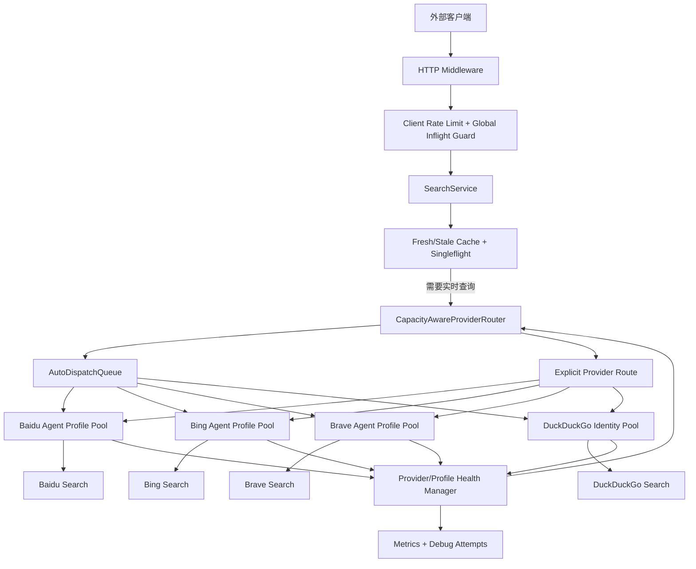
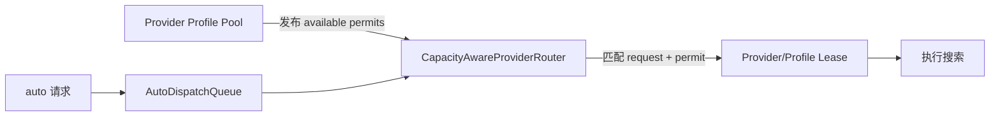
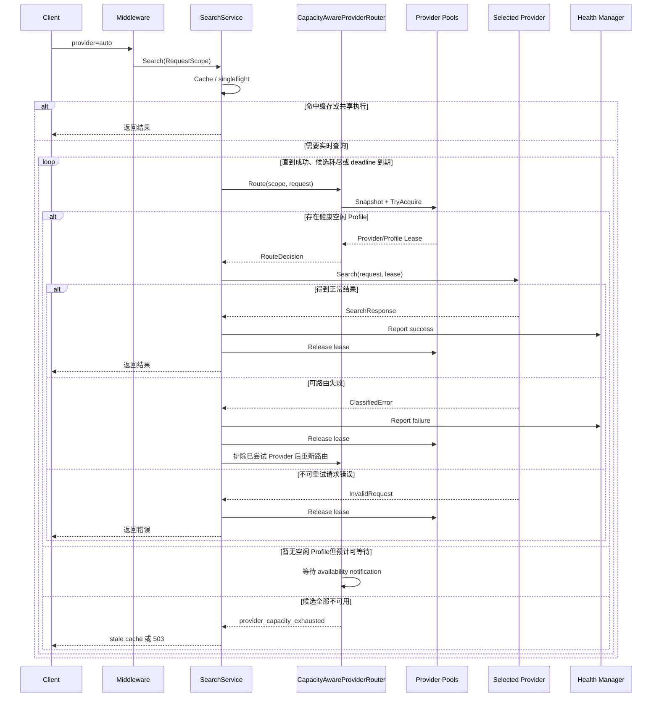
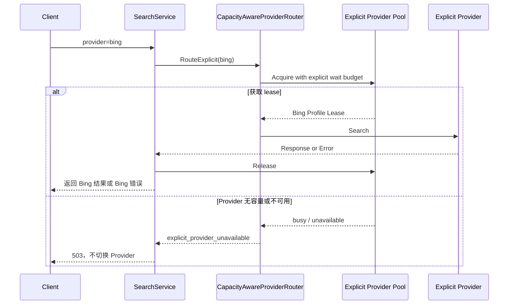
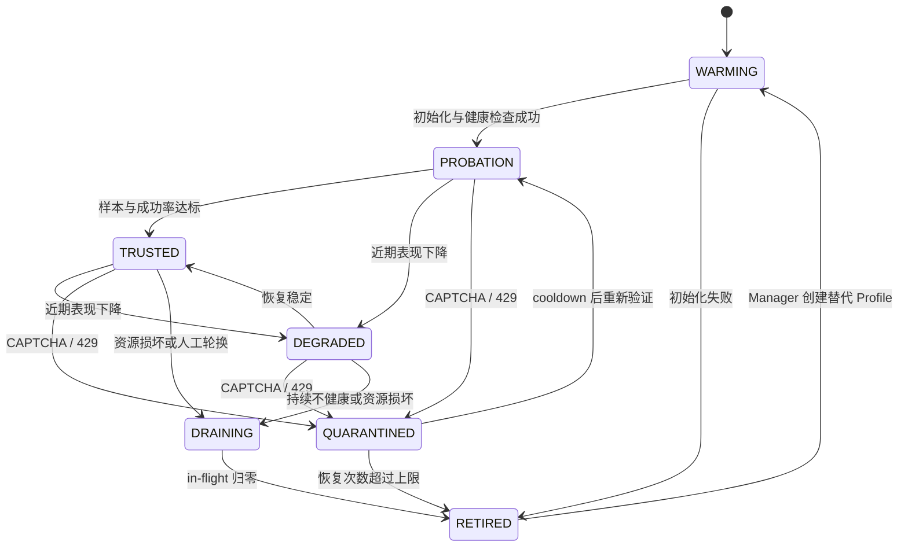
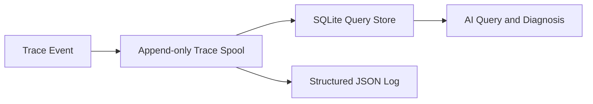

# 容量感知 Provider Agent Profile Pool 技术方案

## 需求梳理

### 背景

当前搜索服务包含 Baidu、Bing、Brave、DuckDuckGo 四个 Provider。`GET /v1/search?provider=auto` 当前通过静态 `ProviderChain` 顺序执行 Provider；组合搜索则通过 `QualityProviderSelector` 并发观察固定 Provider 列表。这两种模式都不了解 Provider 当前拥有多少健康 Profile、剩余多少执行槽位、队列是否拥塞以及近期是否稳定。

当大量外部请求同时进入时，静态顺序会产生以下问题：

- 请求可能持续等待优先 Provider，而其他 Provider 仍有空闲容量。
- Provider 的可用性只能在真正执行请求失败后才能得知，不能在路由前避开冷却或无容量的 Provider。
- Header Profile 只负责选择请求身份，不能管理 Cookie Session、Chrome user-data-dir、并发 lease、排队和生命周期。
- Baidu、Bing、Brave 使用不同 transport，不能共享相同的 Profile 并发参数。
- 显式指定 Provider 与 `auto` 的语义未在资源调度层清晰分离。

### 目标

- 建立 Provider 级 `Agent Profile Pool`，池化完整请求身份与会话资源，而非只轮转 `User-Agent` 字符串。
- Baidu、Bing、Brave、DuckDuckGo 分别拥有 6、5、3、4 个 Profile；单 Profile 并发容量由 Provider 类型独立配置。
- `auto` 请求按严格 Provider 优先级和实时可用 lease 路由；健康度只记录，第一版不参与跨 Provider 调度。
- Provider 有空闲槽位时主动参与消费待调度请求，避免所有请求傻等静态链路第一项。
- 同一个请求在同一个 Provider 内保持 Profile 粘滞，分页、内部重试和诊断均关联同一 lease。
- Provider 执行失败后重新评估当前可用 Provider，而不是机械进入固定的下一项。
- 显式指定 Provider 时严格只使用该 Provider；无容量时允许有限排队，不隐式切换搜索源。
- 入口可以接收 100 个并发请求，同时通过缓存、`singleflight`、有界队列和 Profile 容量限制控制真实上游并发。
- `auto` 严格优先级为 `baidu → bing → brave → duckduckgo`；高优先级 Provider 无法立即取得 lease 时直接尝试下一项。
- GET 与 POST 使用同一条 Provider 链路，取消 `QualityProviderSelector` 的多 Provider 并发搜索。
- 建立请求、路由、Provider、Profile、lease、transport、健康变化的持久化全链路 Trace，供 AI 查询排障。

### 非目标

- 不把不同 Provider 的 Cookie、localStorage 或浏览器 user-data-dir 混用。
- 不在单次 Provider 请求遇到 CAPTCHA 或限流后切换同 Provider 的另一个 Profile继续该次请求。
- 不以 HTTP 200 作为唯一成功条件；必须结合结果解析和响应分类。
- 第一版不将 Profile 健康状态写入数据库。

### 已验证事实

| 验证对象 | 条件 | 结果 | 方案含义 |
|---|---|---|---|
| Baidu 官网直连 | 同一固定请求头，4 个并发 `curl` | 1 个正常结果页，3 个验证页 | 单 Session 不应提高并发 |
| 本地 Baidu Provider | 4 个不同查询，`refresh=true` | 4/4 成功，整批约 12 秒 | 固定 Session 串行有效，内部 transport fallback 可兜底 |
| Bing 官网直连 | 固定请求头，4 个并发 `curl` | 4/4 正常 | 当前出口网络可访问 Bing |
| 本地 Bing Provider | chromedp，4 个并发，`refresh=true` | 0/4，均为 `captcha_required` | 当前持久化浏览器 Profile 不可作为容量基线 |
| 本地 `auto` | 单次实时请求 | Baidu fixed session 成功 | 当前正常路径可用，但尚不具备容量感知路由 |

## 技术方案

### 总体架构



### 核心领域模型

#### RequestScope

middleware 为每个外部请求创建请求作用域，用于关联 Provider 尝试和 Profile lease：

```go
type RequestScope struct {
    RequestID string
    StartedAt time.Time
    Deadline  time.Time
    Attempts  map[domain.ProviderName]struct{}
    Leases    map[domain.ProviderName]*ProfileLease
}
```

`RequestScope` 通过 `context.Context` 传递，不直接暴露到 API JSON。`SearchRequest.RequestID` 保持现有诊断与响应关联能力。

#### AgentProfile

```go
type AgentProfile interface {
    ID() string
    Provider() domain.ProviderName
    Capacity() int
    InFlight() int
    State() ProfileState
    Acquire(context.Context) (*ProfileLease, error)
    Snapshot() ProfileSnapshot
    Close() error
}
```

Profile 代表完整的 Provider 身份与执行资源：

| 组成 | Baidu | Bing/Brave | DuckDuckGo |
|---|---|---|---|
| Header Profile | 独立 | 独立 | 独立 |
| CookieJar | 独立 | 由浏览器 Profile 持有 | 独立 |
| user-data-dir | 不需要 | 独立 | 不需要 |
| Transport/Client | SessionTransport | Browser Client | HTTP Client |
| Pacer/Rate Limit | Profile 独立 + Provider 全局 | Profile semaphore + Provider 全局 | Profile + Provider 全局 |
| Health/Cooldown | 独立 | 独立 | 独立 |

#### ProfileLease

```go
type ProfileLease struct {
    Provider  domain.ProviderName
    ProfileID string
    Acquired  time.Time
    Release   func(ProfileResult)
}
```

lease 必须满足：

- 获取成功后立即增加 Profile `in_flight`。
- 正常返回、错误、请求取消和 panic 均执行一次释放。
- 同一个 `RequestID + Provider` 复用已存在的 lease。
- lease 不跨 Provider 共享。

### Provider 容量模型

Provider 的实时容量为所有健康 Profile 剩余槽位之和：

$$
C_p^{\mathrm{available}}
=
\sum_{i=1}^{N_p}
\mathbf{1}(s_i\in\{\mathrm{PROBATION},\mathrm{TRUSTED}\})
\max(c_i-f_i,0)
$$

参数含义：

- $N_p$：Provider $p$ 的 Profile 数量。
- $s_i$：Profile 当前状态。
- $c_i$：Profile 最大并发容量。
- $f_i$：Profile 当前占用的 lease 数。
- $\mathbf{1}(s_i\in\{\mathrm{PROBATION},\mathrm{TRUSTED}\})$：只有验证中或已信任的可服务 Profile 贡献容量。

建议初始配置：

| Provider | Profile 数 | 单 Profile capacity | Provider 理论容量 | 说明 |
|---|---:|---:|---:|---|
| Baidu | 6 | 1 | 6 | 每个固定 Cookie Session 内严格串行 |
| Bing | 5 | 2 | 10 | 每个 user-data-dir 最多两个 tab，需新 Profile 实测 |
| Brave | 3 | 1 | 3 | 初期保守，实测后调整 |
| DuckDuckGo | 4 | 1 | 4 | HTTP transport，仍受 Provider QPS 限制 |

理论最大同时执行上游请求数：

$$
C_{\mathrm{upstream}}
=6+10+3+4
=23
$$

这是资源槽位上限，不代表上游吞吐量。Baidu 每个 Session 仍有 3–5 秒 pacing，其稳定吞吐由 Profile 数和间隔共同决定。

### 容量感知 Provider Router

#### ProviderSnapshot

每个 Provider Pool 向 Router 暴露只读快照：

```go
type ProviderSnapshot struct {
    Provider          domain.ProviderName
    State             ProviderState
    ActiveProfiles    int
    AvailableSlots    int
    InFlight          int
    QueueDepth        int
    SuccessEWMA       float64
    FailureEWMA       float64
    P95Latency        time.Duration
    LastFailureClass  domain.Classification
    NextAvailableAt   time.Time
}
```

#### 候选过滤

`auto` 模式只在以下 Provider 中选择：

- Provider 状态为 `AVAILABLE` 或 `DEGRADED`。
- 至少存在一个 `PROBATION` 或 `TRUSTED` Profile。
- 存在空闲 slot，或者预计等待时间小于本次路由等待预算。
- 本请求尚未尝试该 Provider。
- Provider circuit breaker 未打开。

#### 严格优先级与容量门控

第一版不使用 Provider 健康评分、成功率或延迟改变跨 Provider 顺序。Router 严格执行：

1. 对 Baidu 执行原子 `TryAcquire()`；成功则使用 Baidu。
2. Baidu 无可用 lease 时立即尝试 Bing，不等待 Baidu。
3. 依次尝试 Brave、DuckDuckGo。
4. 所有 Provider 均无可用 lease 时，进入全局队列最多等待 2 秒。

Provider 健康度、成功率、延迟和错误分类仍完整记录到 Trace Store，为后续是否引入动态健康路由提供数据。明确的 `WARMING`、`QUARANTINED`、`UNAVAILABLE` 和 circuit-open 状态会阻止 lease 获取，但不计算跨 Provider 健康分。

单个 `auto` 请求最多尝试 3 个不同 Provider；同一个 Provider 每次请求最多尝试一次。重新路由前剩余 deadline 少于 3 秒时停止新尝试，并优先返回 stale cache。

#### Pull-based 调度语义

Provider Pool 不直接读取 HTTP 请求，而是通过可用 permit 向 Router 表达消费能力：



实现上不采用易产生竞态的“先读 Snapshot、稍后 Acquire”。Router 在选择 Provider 后必须原子调用 `TryAcquire()`；如果 lease 已被其他请求占用，则重新评估候选 Provider。

### `auto` 请求时序



### 显式 Provider 时序

显式 `provider=baidu|bing|brave|duckduckgo` 时不参与跨 Provider 路由：



### Profile 内部调度

Provider 已选定后，在该 Provider Pool 内选择 Profile。Profile 信任状态参与 Provider 内部调度，但不影响跨 Provider 优先级。

$$
P_i
=
v_i
+w_c\frac{f_i}{c_i}
+w_hH_i
+w_aA_i
$$

参数含义：

- $v_i$：状态惩罚；非 `PROBATION/TRUSTED` Profile 不参与普通流量选择。
- $f_i/c_i$：Profile 当前归一化负载。
- $H_i$：Profile 近期失败健康惩罚。
- $A_i$：资源健康与生命周期评估惩罚。

选择分数最低的 Profile，并原子增加 `in_flight`。

Profile 流量按成熟阶段配置为：

$$
80\% \rightarrow \mathrm{TRUSTED}
$$

$$
20\% \rightarrow \mathrm{PROBATION}
$$

没有 `TRUSTED` Profile 时，由健康的 `PROBATION` Profile按负载均衡承接。比例必须配置化，并通过 A/B 实验调整。

### Baidu Profile Pool

每个 Baidu Profile 包含：

- 固定 Header Profile。
- 独立 CookieJar。
- 独立 `BaiduSessionTransport`。
- 独立 bootstrap、generation 和 cooldown 状态。
- 独立 gate，`capacity=1`。
- 独立 Pacer，仍保持请求完成后 3–5 秒间隔。

Baidu 的 Provider 并发来自 6 个独立 Profile：

$$
C_{\mathrm{baidu}}=6\times1=6
$$

ProfilePool 必须保留 Provider 全局流控，防止多个独立 Session 将总请求速率扩大到不受控水平。第一阶段按 `1 → 2 → 4 → 6` Profile 灰度，不一次性启用全部容量。

### Bing 与 Brave Profile Pool

每个浏览器 Profile 必须拥有独立 user-data-dir 和独立 browser client：

```text
var/provider-profiles/bing/profile-0001/
var/provider-profiles/bing/profile-0002/
var/provider-profiles/brave/profile-0001/
```

目录仅表达运行结构，不要求手工创建；由 Profile factory 创建并管理。

Bing 当前持久化 Profile 已返回验证页，因此发布前必须以全新隔离 Profile 完成基线测试。不能把当前异常 Profile 的结果用于判断 `capacity=2` 是否足够。

### Profile 信任、生命周期与自适应淘汰



Profile 信任基础值采用带先验的成功概率：

$$
T_{\mathrm{base}}
=
\frac{S+\alpha}{S+F+\alpha+\beta}
$$

近期表现使用 EWMA：

$$
T_{\mathrm{recent},t}
=
\lambda T_{\mathrm{recent},t-1}
+(1-\lambda)R_t
$$

其中正常结果计为成功；网络超时和 5xx 低权重计入失败；页面解析变化归因于 Provider；CAPTCHA、429 单独进入风险状态。

第一版 `TRUSTED` 晋升基线：

- 至少 20 次有效搜索。
- 正常结果成功率不低于 90%。
- 近期 EWMA 不低于 90%。
- `PROBATION` 阶段无 CAPTCHA。
- 不允许连续 3 次失败。

请求次数和存活时间只触发重新评估，不直接淘汰。高信任 Profile 可以延长生命周期；持续不健康、资源损坏或多次恢复失败才进入 `DRAINING`。

| 事件 | Profile 动作 | Provider 动作 |
|---|---|---|
| 正常结果 | 更新长期信任与近期 EWMA | 只记录 Provider 健康度 |
| 网络超时/5xx | 增加低权重失败分 | 只记录 Provider 健康度 |
| CAPTCHA | Profile quarantined | 若健康 Profile 仍存在则继续服务新请求 |
| 429 | Profile cooldown | Provider 全局 limiter 收紧 |
| 页面解析变化 | 不归咎单 Profile | Provider circuit breaker 评估 |
| Browser 崩溃 | Profile unhealthy 并重建 | 其他 Profile继续服务 |
| 达到次数或年龄评估点 | 评估保留、降级或 draining | 不直接强制淘汰 |

### 外部并发与队列

入口并发与上游并发分离：

$$
R_{\mathrm{live}}
=
R_{\mathrm{external}}
-R_{\mathrm{cache}}
-R_{\mathrm{singleflight}}
$$

目标配置：

| 层级 | 建议值 |
|---|---:|
| 全局外部 in-flight | 100 |
| 同客户端 burst | 100，需显式配置 |
| AutoDispatchQueue 上限 | 100 |
| 理论上游 slot | 23 |
| 普通搜索总 timeout | 20 秒 |
| 组合搜索总 timeout | 30 秒 |

当 100 个不同查询同时进入且均未命中缓存时，最多 23 个请求持有上游 lease，其余请求在有界队列中等待 Provider 发布新 permit。队列满后快速返回 `server_busy`，避免 goroutine 和内存无界增长。

每个 Provider 同时保留 Profile 层容量控制与 Provider 级全局 rate limiter。Profile capacity 决定并发上限，Provider limiter 决定所有 Profile 合计的启动速率与 burst；具体值通过阶梯压测确定。

显式 Provider 使用对应 Provider 专属队列，lease 最多等待 5 秒；`auto` 使用全局队列，所有 Provider 无容量时最多等待 2 秒。Provider permit 同时面对显式与 `auto` 请求时，最多连续服务 3 个显式请求，然后允许 1 个 `auto` 请求，避免饥饿。

### 路由结果与错误模型

新增路由原因：

```go
type RouteReason string

const (
    RouteReasonExplicit       RouteReason = "explicit"
    RouteReasonPriority       RouteReason = "priority"
    RouteReasonCapacity       RouteReason = "available_capacity"
    RouteReasonRetryReroute   RouteReason = "retry_reroute"
)
```

新增错误码：

| 错误码 | HTTP | 含义 |
|---|---:|---|
| `provider_busy` | 503 | 显式 Provider 有效但当前无可用容量 |
| `provider_capacity_exhausted` | 503 | `auto` 候选 Provider 均无容量 |
| `search_queue_full` | 503 | 全局实时查询队列已满 |
| `profile_acquire_timeout` | 503 | 在请求剩余预算内未取得 lease |

响应 `meta` 增加：

```json
{
  "selected_provider": "bing",
  "route_reason": "available_capacity",
  "profile_id": "bing-0003",
  "provider_available_slots": 7,
  "provider_queue_ms": 18
}
```

普通响应中的 `profile_id` 应使用不可反推本地路径的短 ID；本地 user-data-dir 仅在授权 debug artifact 中出现。

### 统一链路与重路由条件

取消 `QualityProviderSelector` 的多 Provider 并发搜索。GET 与 POST 每次只执行一个 Provider，并统一经过容量感知链路。

以下情况允许排除当前 Provider 后重新路由：

- CAPTCHA。
- 429 或上游限流。
- Provider 不可用。
- 上游超时。
- 页面解析结构变化。
- 返回 0 条有效结果。
- POST 正文组合搜索最终可读正文数量不足。

普通 GET 已返回有效结果时，不因质量评分偏低继续调用下一个 Provider。质量评分只用于 Trace、Profile Trust 和后续分析。

### 全链路 Search Trace

每个请求必须能够按时间顺序还原：请求、缓存、排队、路由、Provider、Profile、lease、transport、结果分类、信任变化、重路由和最终响应。



统一关联字段：

| 层级 | 核心字段 |
|---|---|
| 请求 | trace_id, request_id, event_sequence, requested_provider |
| 路由 | route_round, candidates, excluded_reasons, route_reason |
| Provider | provider, available_slots, in_flight, queue_depth |
| Profile | profile_id, generation, stage, trust_before, trust_after |
| Lease | lease_id, acquired_at, released_at, hold_ms |
| Transport | strategy, transport, elapsed_ms, classification |
| 响应 | selected_provider, result_count, cached, degraded, total_ms |

事件先同步追加到本地 append-only spool，后台消费者再写入 SQLite 并输出结构化 JSON 日志。SQLite 暂时不可用时保留 spool，恢复后重放；只有 SQLite 确认提交的 segment 才允许清理。

Trace Store 至少包含：

- `search_traces`
- `route_decisions`
- `provider_attempts`
- `profile_lease_events`
- `profile_health_events`

默认只保存 query hash、字符数和脱敏预览；`SEARCH_TRACE_STORE_QUERY=true` 时才保存完整 query。Cookie、Token、敏感 Header 和本地绝对 Profile 路径永不进入 Trace Store。

保留策略：请求 Trace 7 天，Profile 健康与生命周期事件 30 天，SQLite 最大 1 GB，JSON 日志按天轮转并保留 7 天；每小时清理一次，优先清理最旧且已完成的请求，最近 24 小时 Profile 异常事件受保护。

### 配置设计

```text
SEARCH_GLOBAL_INFLIGHT_MAX=100
SEARCH_AUTO_QUEUE_MAX=100
SEARCH_AUTO_ROUTE_WAIT=2s
SEARCH_EXPLICIT_ROUTE_WAIT=5s

SEARCH_BAIDU_PROFILE_COUNT=6
SEARCH_BAIDU_PROFILE_CAPACITY=1
SEARCH_BAIDU_PROFILE_EVALUATE_AGE=24h
SEARCH_BAIDU_PROFILE_EVALUATE_REQUESTS=500

SEARCH_BING_PROFILE_COUNT=5
SEARCH_BING_PROFILE_CAPACITY=2
SEARCH_BING_PROFILE_ROOT=./var/provider-profiles/bing
SEARCH_BING_PROFILE_EVALUATE_AGE=24h
SEARCH_BING_PROFILE_EVALUATE_REQUESTS=500

SEARCH_BRAVE_PROFILE_COUNT=3
SEARCH_BRAVE_PROFILE_CAPACITY=1
SEARCH_BRAVE_PROFILE_ROOT=./var/provider-profiles/brave

SEARCH_DUCKDUCKGO_PROFILE_COUNT=4
SEARCH_DUCKDUCKGO_PROFILE_CAPACITY=1

SEARCH_PROFILE_TRUSTED_TRAFFIC_PERCENT=80
SEARCH_PROFILE_PROBATION_MIN_SAMPLES=20
SEARCH_PROFILE_PROBATION_MIN_SUCCESS_RATE=0.90
SEARCH_PROFILE_PROBATION_MIN_RECENT_EWMA=0.90
SEARCH_PROFILE_MAX_CONSECUTIVE_FAILURES=3

SEARCH_TRACE_ENABLED=true
SEARCH_TRACE_ROOT=./var/trace
SEARCH_TRACE_FAILURE_MODE=strict
SEARCH_TRACE_STORE_QUERY=false
SEARCH_TRACE_REQUEST_RETENTION=168h
SEARCH_TRACE_PROFILE_RETENTION=720h
SEARCH_TRACE_SQLITE_MAX_BYTES=1073741824
SEARCH_TRACE_LOG_RETENTION=168h
```

`SEARCH_TRACE_FAILURE_MODE` 支持：

- `strict`：append-only spool 无法写入时 readiness 失败，并拒绝新请求，返回 `503 trace_persistence_unavailable`。
- `best_effort`：搜索继续执行，写标准错误日志并重试持久化；该模式不保证所有 Trace 事件均可恢复。

所有配置需有上限校验，避免错误配置一次启动大量 Chrome 实例。

### 代码与模块调整

#### 新增模块

| 文件 | 主要类型/方法 | 职责 |
|---|---|---|
| `internal/profilepool/profile.go` | `AgentProfile`, `ProfileLease` | 通用 Profile 与 lease 定义 |
| `internal/profilepool/pool.go` | `Pool.Acquire`, `Pool.TryAcquire` | Provider 内 Profile 调度 |
| `internal/profilepool/state.go` | `ProfileState` | 生命周期状态机 |
| `internal/profilepool/health.go` | `HealthTracker.Report` | EWMA、连续失败和 cooldown |
| `internal/profilepool/manager.go` | `Manager.Reconcile` | warming、draining、retire、补位 |
| `internal/routing/router.go` | `CapacityAwareProviderRouter` | `auto` 与显式 Provider 路由 |
| `internal/routing/queue.go` | `AutoDispatchQueue` | 有界请求等待与通知 |
| `internal/routing/priority.go` | `OrderedCandidates` | 严格 Provider 优先级与已尝试过滤 |
| `internal/provider/baidu/profile_factory.go` | `NewBaiduProfile` | 创建独立 Cookie Session Profile |
| `internal/provider/bing/profile_factory.go` | `NewBingProfile` | 创建独立浏览器 Profile |
| `internal/provider/brave/profile_factory.go` | `NewBraveProfile` | 创建独立浏览器 Profile |
| `internal/searchtrace/spool.go` | `Append`, `Replay` | 可靠 append-only Trace 入口 |
| `internal/searchtrace/store.go` | `TraceStore` | SQLite 可查询历史 |
| `internal/searchtrace/logger.go` | `EventLogger` | 结构化 JSON 日志 |
| `internal/searchtrace/retention.go` | `Cleanup` | 保留周期与容量清理 |

#### 修改模块

| 文件 | 调整 |
|---|---|
| `internal/api/httpapi/middleware.go` | 注入 `RequestScope`，增加全局 in-flight guard |
| `internal/domain/search.go` | 增加路由原因和 meta 字段 |
| `internal/app/search_service.go` | 缓存未命中后调用新 Router |
| `internal/provider/chain.go` | 不再作为 `auto` 主路由；保留兼容或移除 |
| `internal/app/provider_selector.go` | 移除多 Provider 并发质量选择，质量评分降为观测用途 |
| `internal/provider/baidu/session_transport.go` | 保持单 Profile 语义，由 factory 创建多实例 |
| `internal/transport/chromebrowser/client.go` | 支持 Profile 独立实例、健康检查和受控关闭 |
| `internal/bootstrap/app.go` | 组装 Profile Manager、Provider Pools 和 Router |
| `internal/config/config.go` | 增加池、路由、队列、生命周期配置 |
| `compose.yaml` | 持久化 Bing/Brave Profile root 目录 |

### 数据结构与持久化

Profile 当前状态保存在内存中，并在每个 Profile 目录写入版本化 JSON manifest；Trace 使用本地 spool 与 SQLite：

| 数据 | 存储位置 | 重启行为 |
|---|---|---|
| Profile in-flight | 内存 | 重置并重新 warming |
| Profile Trust、阶段、generation | Profile JSON manifest | 加载、时间衰减、warming 检查后恢复 |
| Baidu CookieJar | 内存 | 重建 Session |
| Bing/Brave Cookie 与浏览器状态 | user-data-dir | 保留 |
| Search Trace 事件 | append-only spool | 重放到 SQLite |
| Search Trace 查询视图 | SQLite | 保留并按策略清理 |
| 结构化日志 | JSON log | 按天轮转 |

Manifest 使用临时文件加原子 rename 写入。启动时不因磁盘中的 `TRUSTED` 状态直接接单，必须先进入 `WARMING`；健康检查通过后才恢复为 `PROBATION` 或 `TRUSTED`。

服务 readiness 采用部分就绪策略：任意 Provider 至少一个 Profile 可服务即可通过；其余 Profile 后台 warming。显式请求访问尚未 ready 的 Provider 时返回 `503 provider_warming`；所有 Provider 均无可服务 Profile 时 readiness 失败。

如果未来需要多实例协调，需另行设计分布式 lease 与共享健康状态；本方案只覆盖单进程部署。

### 监控指标

| 指标 | 标签 |
|---|---|
| `search_router_decisions_total` | provider, reason |
| `search_provider_available_slots` | provider |
| `search_provider_queue_depth` | provider |
| `search_profile_inflight` | provider, profile_id |
| `search_profile_state` | provider, profile_id, state |
| `search_profile_acquire_seconds` | provider |
| `search_profile_results_total` | provider, classification |
| `search_provider_reroutes_total` | from, to, reason |
| `search_global_inflight` | endpoint |
| `search_auto_queue_rejected_total` | reason |
| `search_trace_spool_append_total` | result |
| `search_trace_sqlite_write_total` | result |
| `search_trace_replay_backlog` | segment |
| `search_trace_persistence_state` | mode, state |

## 关键逻辑和影响范围

| 逻辑点 | 说明 |
|---|---|
| 静态 Chain 改动态 Router | `auto` 在执行前获取 Provider 实时容量，不等待固定第一项 |
| Provider permit | Provider Pool 通过可用 lease 表达消费能力 |
| 原子 TryAcquire | 避免 Snapshot 与实际占用之间的竞态 |
| 显式 Provider 严格隔离 | 指定 Provider 无容量时排队或返回错误，不跨源 |
| 请求级粘滞 | 同一请求在同一 Provider 中不切换 Profile |
| Baidu 多 Profile | 多个独立 Session 并行，每个 Session 内仍 capacity=1 |
| 浏览器 Profile 隔离 | Bing/Brave 每个 Profile 使用独立 user-data-dir 和 client |
| 动态重路由 | Provider 执行失败后重新计算候选，不机械选择静态下一项 |
| 有界队列 | 入口 100 并发不会转化为 100 个上游并发或无界 goroutine |
| 自适应信任生命周期 | Profile 越用越稳定时允许长期保留，次数和年龄只触发评估 |
| 健康归因 | 解析变化归 Provider，Cookie/Browser 故障归 Profile |
| 健康与调度分离 | Provider 健康度第一版只记录；跨 Provider 严格按优先级和 lease 可用性 |
| 完整 Trace | 请求到 Profile/Provider/transport/健康变化均持久化，支持 AI 查询 |
| 可回滚 | Feature flag 可恢复当前静态链路和单 Profile 实现 |

影响范围包括 HTTP middleware、SearchService、Provider 选择、Provider 实例构造、浏览器资源管理、配置、Docker volume、诊断响应和监控。业务数据库无 migration；Trace SQLite schema 由 Trace Store 自身进行版本管理。

## 发布策略

### 第一阶段：框架影子运行

- 实现 ProfilePool、Router 和 Snapshot，但真实请求仍走旧链路。
- 新 Router 只记录“如果启用会选哪个 Provider”。
- 对比旧链路实际 Provider 与新 Router 决策。
- Baidu 保持 `1 × 1`，Bing/Brave 保持单 client。

### 第二阶段：单 Provider 池化

- Baidu 从 `1 × 1` 灰度到 `2 × 1`，观察成功率和全局请求速率。
- Bing 使用全新 Profile 做 `1 × 1` 基线测试；健康后测试 `1 × 2`。
- Brave 先执行 `1 × 1` 基线。
- DuckDuckGo 接入 IdentityPool。
- Profile Trust 晋升初值按 20 个样本、90% 成功率、90% EWMA 验证。
- 使用 A/B 对比全新 Profile、固定淘汰、长期复用和自适应 Trust 四种策略。

### 第三阶段：动态 Router 灰度

- 先对 10% `auto` 请求启用容量感知路由。
- 保持显式 Provider 行为不变。
- 观察 route reason、Profile 等待、reroute、成功率、Trust 变化与 P95。
- 逐步提高到 50% 和 100%。

### 第四阶段：扩展到目标容量

- Baidu Profile 数按 `2 → 4 → 6` 扩展，单 Profile capacity 始终为 1。
- Bing 按 `1 × 1 → 1 × 2 → 2 × 2 → 5 × 2` 扩展。
- Brave 按 `1 × 1 → 2 × 1 → 3 × 1` 扩展。
- 每阶段执行入口并发 `1、2、4、8、16、32、100` 的阶梯压测。
- 入口可达 100 并发，但上游执行不得超过 ProfilePool 总 slot。

### 验收指标

- 入口 100 并发时无 goroutine、队列和内存无界增长。
- `in_flight` 永不超过 Profile capacity。
- 同一 `RequestID + Provider` 只关联一个 Profile ID。
- `auto` 不在已满 Provider 前长期排队，而能使用其他健康 Provider。
- 显式 Provider 不发生跨源路由。
- 正常响应与合法 fallback 合计成功率不低于 99%。
- lease 泄漏数量为 0。
- Profile draining 不终止在途请求。
- Router 决策和实际取得的 Provider/Profile 一致。
- Profile manifest 可跨重启恢复，并在 warming 后正确恢复阶段。
- 每个已完成请求均可通过 trace_id 在 SQLite 中还原完整链路。
- strict Trace 模式下 spool 不可写时 readiness 失败且拒绝新请求。

### 回滚

- 增加 `SEARCH_CAPACITY_ROUTER_ENABLED=false`，恢复现有静态 `ProviderChain`。
- 增加 `SEARCH_PROFILE_POOL_ENABLED=false`，恢复单 Profile Provider。
- 回滚不删除现有 user-data-dir。
- Profile Manager 停止时先 draining，再关闭 browser client。

## Checklist

- [x] 定义 `RequestScope` 并通过 context 贯穿 SearchService 与 Provider
- [x] 定义 `AgentProfile`、`ProfileLease`、`ProfileSnapshot`
- [x] 实现并发安全的 `TryAcquire`、`Acquire`、`Release`
- [x] 实现 Profile 最少负载调度与公平 tie-breaker
- [ ] 实现 Profile 状态机、健康 EWMA、cooldown 和 lifecycle manager（状态机已完成，runtime lifecycle manager 尚未接入）
- [x] 实现 Profile Trust、`PROBATION/TRUSTED` 晋升及 80/20 流量分配
- [x] 实现每 Profile JSON manifest、原子写入、时间衰减和启动恢复
- [x] 实现 `ProviderSnapshot` 和 Provider 可用 permit 通知
- [x] 实现有界 `AutoDispatchQueue`
- [x] 实现 `CapacityAwareProviderRouter`
- [x] 实现显式 Provider 严格路由
- [x] 实现 `auto` 动态路由和已尝试 Provider 排除
- [x] 将严格优先级设置为 `baidu → bing → brave → duckduckgo`
- [x] 取消 `QualityProviderSelector` 多 Provider 并发搜索
- [x] 实现最多 3 个 Provider attempt 与剩余 3 秒 deadline 门槛
- [x] 实现显式队列 5 秒、auto 队列 2 秒等待上限
- [x] 实现显式请求连续 3 次后让出 1 次 auto permit 的公平策略
- [x] Baidu SessionTransport 支持 factory 创建 6 个独立 Profile
- [x] Baidu Profile 保持单 Session `capacity=1`
- [x] Bing 创建 5 个独立 user-data-dir，Brave 创建 3 个
- [x] DuckDuckGo 接入轻量 IdentityPool
- [x] 为每个 Provider 保留可配置的全局 rate limiter
- [x] 增加全局 in-flight guard 与有界队列
- [x] 增加路由 meta、错误码和 debug attempt 字段
- [ ] 实现 append-only Trace spool、SQLite Store 和结构化 JSON 日志（可靠 spool/SQLite 已完成，后台 segment consumer 与日志轮转待完成）
- [ ] 实现 Trace schema、重放、保留周期、容量清理和 query 脱敏（SQLite 部分已完成，spool segment retention 待完成）
- [x] 实现 `strict/best_effort` Trace 故障模式
- [x] 实现部分 Profile就绪的 readiness 逻辑
- [x] 增加配置校验和浏览器实例数量硬上限
- [x] 增加 Router、Pool 基础状态和取消释放单元测试
- [x] 增加同一请求 Profile 粘滞测试
- [x] 增加显式 Provider 不跨源测试
- [x] 增加 Snapshot/TryAcquire 竞态测试
- [x] 增加 Profile draining 与自动补位单元测试（runtime 自动补位接线待完成）
- [x] 增加 Trust A/B、晋升、退化、跨重启恢复测试
- [x] 增加 Trace spool 故障、SQLite 重放和 strict readiness 测试
- [x] 增加 Baidu 独立 CookieJar 集成测试
- [x] 增加 Bing/Brave 独立 user-data-dir 集成测试
- [ ] 影子运行 Router 并核对决策指标
- [ ] 按 Provider 执行真实环境阶梯压测
- [x] 执行 100 入口并发、有界上游并发验收
- [x] 验证 feature flag 回滚流程
