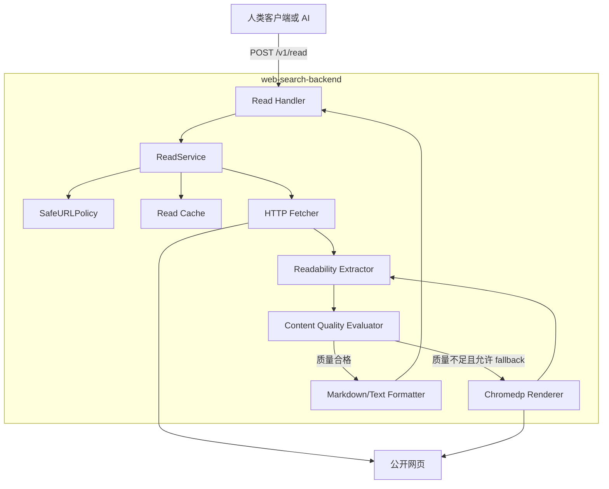
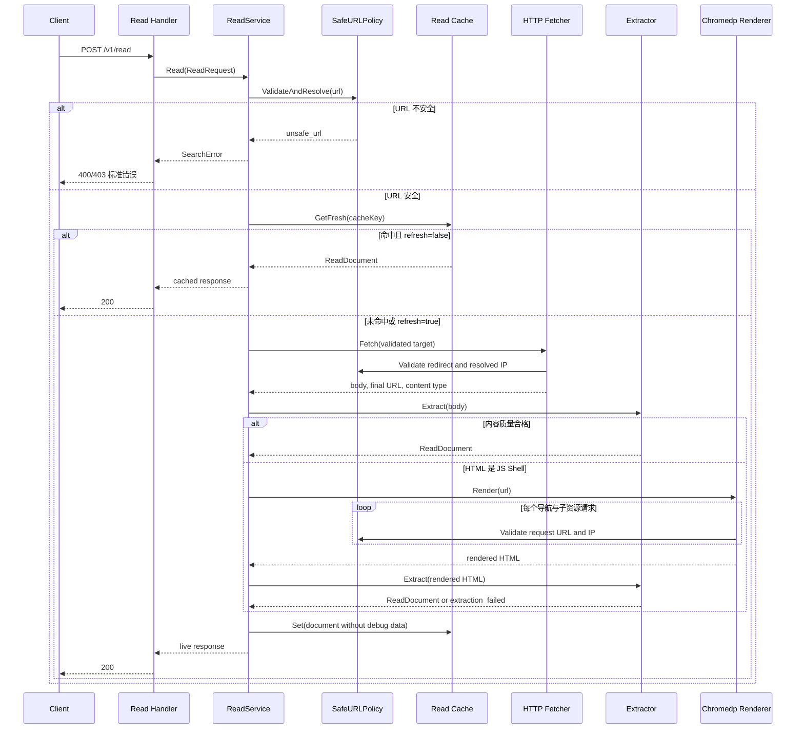

# 正文读取 API 设计规范

## 需求梳理

### 解决什么问题

搜索 API 只能返回标题、URL 和搜索引擎摘要，不能为 AI 提供完整、干净、长度可控的网页正文。本方案新增独立的 `POST /v1/read`：接收一个公开 URL，安全获取资源，提取主要内容并标准化为 Markdown 或纯文本。

### 第一阶段范围

- 支持 `text/html` 和 `text/plain`。
- 支持普通 HTTP 页面和需要 JavaScript 渲染的页面。
- 使用 `HTTP -> Readability -> Chromedp fallback` 链路。
- 支持内存缓存、`refresh`、授权 `debug`、stale cache 降级和原始错误追踪。
- 每次请求只读取一个 URL，不递归抓取站内链接。
- PDF、Word、Excel、图片 OCR、批量读取和异步任务属于第二阶段。

这里的“源格式”是目标 URL 返回的资源类型；API 响应本身始终为 JSON，正文可选择 Markdown 或纯文本。

### 非目标

- 不破解验证码、登录、付费墙或访问控制。
- 不携带调用方 Cookie、Authorization 或浏览器登录状态。
- 不执行站点级爬虫，不发现或跟随正文中的链接。
- 不保证任意网页都能被 Readability 正确识别。
- 第一阶段不解析 PDF，包括文本 PDF 和扫描 PDF。

## 技术方案

### 整体架构



### 主流程时序



### HTTP 接口

#### 请求

```http
POST /v1/read
Content-Type: application/json
X-Debug-Token: <仅 debug=true 时需要>
```

```json
{
  "url": "https://example.com/article",
  "format": "markdown",
  "max_chars": 30000,
  "refresh": false,
  "debug": false
}
```

| 字段 | 类型 | 必填 | 默认值 | 约束 |
|---|---:|---:|---:|---|
| `url` | string | 是 | 无 | 最大 2048 字符，只允许公开 `http`、`https` URL |
| `format` | string | 否 | `markdown` | 允许 `markdown`、`text` |
| `max_chars` | integer | 否 | `30000` | 取值 1000 至 100000 |
| `refresh` | boolean | 否 | `false` | 跳过 fresh cache，失败时仍可返回 stale cache |
| `debug` | boolean | 否 | 服务配置 | `true` 时隐含 `refresh=true`，必须提供有效 `X-Debug-Token` |

#### 成功响应

```json
{
  "url": "https://example.com/article",
  "final_url": "https://example.com/article",
  "title": "文章标题",
  "author": "作者",
  "published_at": "2026-07-14T08:00:00Z",
  "language": "zh-CN",
  "source_type": "html",
  "content": "# 文章标题\n\n正文内容",
  "content_format": "markdown",
  "content_length": 12580,
  "truncated": false,
  "meta": {
    "transport": "http",
    "extractor": "readability",
    "cached": false,
    "degraded": false,
    "fallback_count": 0,
    "took_ms": 312,
    "request_id": "req_example"
  },
  "warnings": []
}
```

| 响应字段 | 说明 |
|---|---|
| `url` | 调用方提交的 URL |
| `final_url` | 完成安全校验后的最终重定向 URL |
| `source_type` | `html` 或 `text` |
| `content` | 标准化且已按 `max_chars` 限制的正文 |
| `content_length` | 返回正文的 Unicode 字符数量，不是字节数 |
| `truncated` | 正文是否因 `max_chars` 被截断 |
| `meta.transport` | `http`、`chromedp`、`fresh_cache` 或 `stale_cache` |
| `meta.extractor` | `readability` 或 `plain_text` |
| `meta.fallback_count` | 从 HTTP 提取切换到浏览器的次数，第一阶段为 0 或 1 |

截断优先发生在段落边界；找不到合适边界时才按 Unicode rune 截断，禁止按字节截断 UTF-8。

### 错误模型

| Error Code | HTTP | Retryable | 场景 |
|---|---:|---:|---|
| `invalid_request` | 400 | false | 参数为空、格式或长度不合法 |
| `unsafe_url` | 403 | false | 内网、回环、Metadata、非法协议或重定向目标不安全 |
| `unsupported_content_type` | 415 | false | PDF、图片、Office 或其他未支持资源 |
| `content_too_large` | 413 | false | 响应体超过硬上限 |
| `fetch_timeout` | 504 | true | HTTP 或浏览器读取超时 |
| `fetch_failed` | 502 | true | DNS、TLS、连接或上游 5xx 失败 |
| `captcha_required` | 503 | true | 页面明确要求安全验证 |
| `extraction_failed` | 422 | false | HTTP 与浏览器均无法提取有效正文 |

普通响应只返回稳定错误信息。授权 Debug 响应额外返回每次 HTTP/Browser Attempt、最终 URL、状态码、耗时、已脱敏 Header、正文预览哈希及 artifact 路径，保留最底层原始错误。

### 内容获取和类型识别

HTTP Fetcher 使用独立 `http.Client` 和 Transport，不复用百度或 DuckDuckGo 的 Cookie Jar。规则如下：

- 总读取超时默认 15 秒，HTTP 阶段默认 6 秒，Chromedp 阶段默认 9 秒。
- 最多跟随 5 次重定向，每次重定向重新执行 URL、DNS 和 IP 校验。
- 响应体硬上限默认 5 MiB，超过立即停止读取。
- 优先使用合法 `Content-Type`；缺失或明显错误时只用前 512 字节执行 `http.DetectContentType`。
- 只接受 `text/html`、`application/xhtml+xml`、`text/plain`。
- 不自动解压无限数据；解压后的正文仍受 5 MiB 上限约束。
- 不发送 Cookie、Authorization、Proxy-Authorization 或来源页面凭据。

### SSRF 防护

`/v1/read` 接受调用方 URL，属于 SSRF 高风险入口。第一阶段必须同时保护 HTTP Fetcher 和 Chromedp Renderer：

1. 只允许 `http`、`https`，禁止 URL userinfo、非规范端口和超长 Host。
2. DNS 解析出的全部 IPv4/IPv6 地址都必须是公开地址；任意地址落入禁止网段则拒绝。
3. 禁止 loopback、private、link-local、multicast、unspecified、CGNAT 和云 Metadata 地址。
4. HTTP Transport 使用校验后的解析结果建立连接，并保留原 Host 作为 HTTP Host 与 TLS Server Name，降低 DNS rebinding 风险。
5. 每次重定向重新校验，禁止从公网 URL 跳转到内网。
6. Chromedp 使用 CDP request interception，对主文档、XHR、脚本、iframe 和其他子资源逐个执行相同策略；不能完成校验的请求直接阻断。
7. 禁止 `file:`、`data:`、`blob:` 主导航和浏览器下载。
8. 默认拒绝内网访问；本机 Demo 如确需访问内网站点，只允许通过显式 Host allowlist 开放，不提供全局关闭 SSRF 防护的开关。

### HTML 正文提取

首选 `github.com/go-shiori/go-readability`，它从 HTML 文档提取标题、作者、站点名、发布时间候选和主要内容。Readability 输出的正文 HTML 再交给 `github.com/JohannesKaufmann/html-to-markdown/v2` 转换为 Markdown；纯文本输出则从提取后的 DOM 生成段落文本。两个库都只处理已获取的内容，不自行访问 URL。

提取前删除 `script`、`style`、`noscript`、导航、广告和明显交互控件。相对链接根据 `final_url` 转成绝对 URL。禁止把隐藏脚本、事件属性和表单凭据带入输出。

相关依赖当前文档：[go-readability](https://pkg.go.dev/github.com/go-shiori/go-readability)、[html-to-markdown/v2](https://pkg.go.dev/github.com/JohannesKaufmann/html-to-markdown/v2)。

### 内容质量和浏览器 fallback

HTTP 返回 200 不等于读取成功。提取结果满足以下全部最低条件才直接返回：

- 去空白后正文不少于 200 个 Unicode 字符，纯文本资源除外。
- 至少存在标题或两个有效段落。
- 正文不是登录、安全验证、错误提示或 Cookie Banner 的重复文本。
- 链接文字占比不过高，且正文不是纯导航列表。

只有 HTTP 已成功返回 HTML，但识别为 JavaScript Shell 或 Readability 结果过短时，才进入 Chromedp。HTTP 401、403、429、验证码和明确登录页不通过浏览器重试，避免把浏览器 fallback 当作访问控制绕过工具。

Chromedp 规则：

- 复用浏览器进程，每次请求使用隔离的无痕 Context，不共享跨站 Cookie 或 Storage。
- 最大并发默认 2，等待槽位也计入总超时。
- 阻止图片、字体、媒体和下载；保留文档、CSS、JavaScript、XHR/fetch。
- 等待 `DOMContentLoaded` 后观察 DOM 稳定，最长等待 3 秒，不无限等待网络空闲。
- 获取渲染后 HTML，再运行同一 Readability 和质量检查，不维护第二套解析逻辑。

### 纯文本处理

`text/plain` 不使用 Readability，也不进入浏览器 fallback：

- 根据 Content-Type charset 解码；缺失时优先 UTF-8，非法字节返回 warning 并安全替换。
- 统一换行为 `\n`，移除 NUL 和不可显示控制字符。
- 连续空行最多保留两行。
- 根据段落边界执行 `max_chars` 截断。

### 缓存和降级

缓存保存与输出格式无关的规范化 `ReadDocument`，不保存 Debug 信息。缓存键使用移除 fragment 后的规范 URL；同一正文可在响应阶段转换为 Markdown 或 text，并按请求的 `max_chars` 截断。

- fresh TTL 默认 30 分钟。
- stale TTL 默认 24 小时。
- `refresh=false` 优先返回 fresh cache。
- `refresh=true` 跳过 fresh cache。
- 实时读取失败且存在 stale cache 时返回旧正文，`meta.degraded=true`，并加入 `live_read_unavailable` warning。
- Cache 中保留 `final_url`、标题、元数据、规范正文和抓取时间。

### 数据模型

第一阶段不新增数据库表。核心领域模型：

| 类型 | 关键字段 | 职责 |
|---|---|---|
| `ReadRequest` | URL, Format, MaxChars, Refresh, Debug, RequestID | 标准化读取请求 |
| `ReadDocument` | URL, FinalURL, Title, Author, PublishedAt, Language, SourceType, ContentHTML, ContentText, StoredAt | 缓存和格式化前的规范正文 |
| `ReadResponse` | Content, ContentFormat, ContentLength, Truncated, Meta, Warnings, Debug | API 输出 |
| `ReadAttempt` | Transport, RequestURL, FinalURL, HTTPStatus, ContentType, ElapsedMS, Classification, OriginalError | Debug 调用链 |

### 目录与代码调整

| 操作 | 路径 | 主要职责 |
|---|---|---|
| 新增 | `internal/domain/read.go` | Read 请求、文档、响应、错误和 Attempt 模型 |
| 新增 | `internal/app/read_service.go` | 缓存、HTTP、Browser fallback 和格式化编排 |
| 新增 | `internal/api/httpapi/read_handler.go` | `POST /v1/read` 参数绑定与 JSON 响应 |
| 新增 | `internal/read/safeurl/policy.go` | URL、DNS、IP、重定向和 allowlist 策略 |
| 新增 | `internal/read/fetcher/http.go` | 受限 HTTP 获取和 Content-Type 检测 |
| 新增 | `internal/read/renderer/chromedp.go` | 隔离浏览器 Context、请求拦截和渲染 |
| 新增 | `internal/read/extractor/readability.go` | HTML 主内容和元数据提取 |
| 新增 | `internal/read/formatter/formatter.go` | Markdown、纯文本、绝对链接和 rune 截断 |
| 新增 | `internal/read/quality/evaluator.go` | JS Shell、验证码、登录页和正文质量判定 |
| 修改 | `internal/api/httpapi/router.go` | 注册 `/v1/read` |
| 修改 | `internal/bootstrap/app.go` | 装配 ReadService 依赖和关闭浏览器资源 |
| 修改 | `internal/config/config.go` | Read 超时、大小、缓存、并发和 allowlist 配置 |
| 修改 | `go.mod` | 增加 Readability 和 HTML-to-Markdown 依赖 |
| 修改 | `README.md` | 增加接口、配置、错误码和 curl 示例 |

## 关键逻辑和影响范围

| 逻辑点 | 说明 |
|---|---|
| 搜索与读取解耦 | Search 不隐式获取正文，客户端显式选择 URL 后调用 Read |
| SSRF | HTTP 与浏览器所有导航、重定向和子资源统一经过 SafeURLPolicy |
| 单套提取逻辑 | HTTP HTML 与渲染后 HTML 使用同一 Readability 和质量检查 |
| Browser fallback | 仅用于 JS Shell 或正文不足，不用于绕过 401、403、验证码和登录 |
| Debug 隔离 | 原始错误和 artifact 仅授权 Debug 返回，永不写入缓存 |
| UTF-8 安全截断 | 以 Unicode rune 和段落边界截断，不破坏中文和多字节字符 |
| 缓存降级 | 实时失败可返回 stale 正文，并明确 degraded 与 warning |
| 资源边界 | 单 URL、总超时、响应上限、浏览器并发和重定向次数都有硬限制 |

影响范围：新增 Read 领域和 API，不改变 `Provider` 接口，不改变 `GET /v1/search` 响应结构；复用现有 Gin Router、request ID、限流、Debug Token、debug artifact 和内存缓存模式。

## 发布策略

- 默认只绑定现有服务监听地址，不额外开放端口。
- 首次发布可用 `SEARCH_READ_ENABLED=false` 关闭路由；本机 Demo 验证后再默认开启。
- 监控读取成功率、HTTP/Browser fallback 比例、各错误码、缓存命中率、正文长度、P50/P95 延迟和浏览器并发等待时间。
- Browser fallback 错误率或资源占用异常时，可单独设置 `SEARCH_READ_BROWSER_ENABLED=false`，HTTP 与纯文本读取继续可用。
- 回滚只需关闭 Read 路由或回退提交，不影响 Search Provider Chain。

## Checklist

- [ ] 定义 `ReadRequest`、`ReadDocument`、`ReadResponse` 和稳定错误码。
- [ ] 实现 SafeURLPolicy，覆盖 IPv4、IPv6、DNS rebinding、redirect 和 Browser 子资源。
- [ ] 实现受限 HTTP Fetcher、Content-Type 检测、解压后大小限制和超时。
- [ ] 集成 go-readability 和 html-to-markdown/v2。
- [ ] 实现 HTML、纯文本格式化和 UTF-8 安全截断。
- [ ] 实现内容质量检测与 JS Shell 判断。
- [ ] 实现隔离 Chromedp Renderer 和 request interception。
- [ ] 实现 Read Cache、refresh、stale fallback 和 singleflight。
- [ ] 注册 `POST /v1/read` 并复用 Debug Token 授权。
- [ ] 增加 SSRF、重定向、类型、大小、超时、提取、fallback、缓存和 Handler 测试。
- [ ] 增加静态 HTML、JS Shell、验证码、纯文本和异常编码 fixture。
- [ ] 更新 README、配置表、错误码和本机 curl Demo。
- [ ] 第二阶段独立设计 PDF 文本提取、扫描件 OCR、页码和文件安全边界。

## 验收标准

- 普通 HTML 通过 HTTP 路径返回清洁 Markdown 或纯文本。
- JavaScript Shell 在安全策略允许时进入 Chromedp 并返回渲染后正文。
- `text/plain` 不启动浏览器。
- PDF 返回 `unsupported_content_type`，并明确属于第二阶段。
- 内网、回环、Metadata、危险重定向和危险浏览器子资源全部被阻断。
- 普通响应不泄露 Header、Cookie、原始 HTML 或底层错误。
- 授权 Debug 响应保留完整 Attempt 和原始错误。
- refresh、fresh cache、stale cache 和 singleflight 行为可通过离线测试验证。
